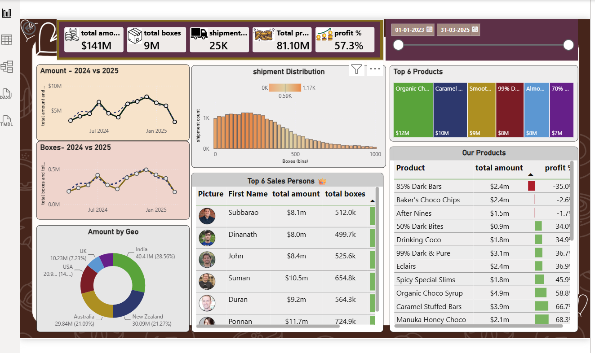

# 🍫 Chocolate Sales Analysis using Power BI

## 📌 Project Overview

This project analyzes chocolate sales data using **Microsoft Power BI** to understand sales performance, product performance, geographical distribution, shipment trends, and salesperson performance.

An interactive dashboard was created to transform raw sales data into meaningful business insights and support data-driven decision-making.

## 🎯 Objectives

* Analyze overall sales performance.
* Compare **2024 and 2025** sales and boxes sold.
* Identify top-performing products and salespersons.
* Analyze sales across different geographical regions.
* Understand shipment and product-level performance.
* Build an interactive and user-friendly dashboard.

## 📊 Dashboard Analysis

The dashboard includes:

* **2024 vs 2025** sales and boxes comparison
* Sales amount by geography
* Top 6 salespersons
* Top 6 products
* Shipment analysis
* Product-level analysis
* Interactive filters and slicers

## 💡 Key Insights

The dashboard helps identify differences in yearly performance, high-performing products and salespersons, geographical sales contribution, and shipment trends.

These insights can help management monitor sales performance and identify areas requiring attention.

## 🛠️ Tools & Skills

* Microsoft Power BI
* Power Query
* DAX
* Data Cleaning & Transformation
* Data Modeling
* Data Visualization
* Business Analysis

## 📚 What I Learned

Through this project, I gained practical experience in **data preparation, Power Query, data modeling, DAX, dashboard design, and business-oriented data analysis**. I also learned how to transform raw sales data into interactive visualizations and actionable business insights.

## 📷 Dashboard Preview

## 🚀 Outcome

Created an interactive Power BI dashboard that provides a clear view of sales, products, geography, shipments, and salesperson performance, helping users make informed business decisions from sales data.
